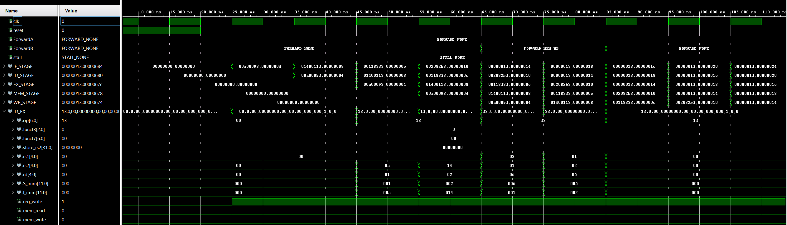
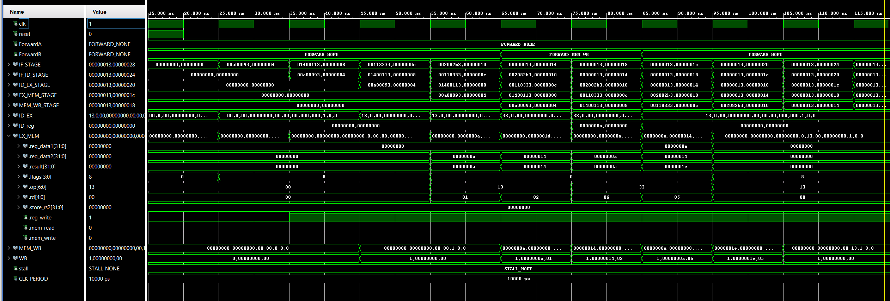

# Pipelined-RISC-V-CPU-in-VHDL-From-Scratch-to-Simulation
## This project is a fully custom, 5-stage pipelined RISC-V CPU built from the ground up in VHDL. 
Each pipeline stage—Instruction Fetch (IF), Decode (ID), Execute (EX), Memory Access (MEM), and Write Back (WB)—was designed with a modular architecture and verified independently to ensure signal integrity and data flow consistency.

## Key features

- 5-stage pipeline: IF, ID, EX, MEM, WB
- ALU operations, load/store support
- Word-aligned memory interface with internal DATA_MEM
- Pipeline registers for each stage 
- Register file write-back with control signal handling
- Hazard-aware architecture (forwarding implemented; built for future extensions such as stalls)
- All design and testing done by me as a deep-dive into CPU architecture

## Open Questions
Design Questions — Port Entry vs Internal Signal

As I was building my pipeline registers and debugging signal flow, I started wondering about the trade-offs between two design choices:

- Option 1: Expose signals as port entries between modules
- Option 2: Keep signals internal and connect them through internal logic

Questions I’m still exploring:
- From a design clarity and maintainability perspective, which approach scales better as the system grows?
- From a hardware synthesis / resource cost perspective, does using ports introduce more overhead than using internal signals?
- Are there any best practices or guidelines for when to prefer one over the other in pipeline register design?

If anyone has insights or resources on this, I would love to learn! I’d like to apply better-informed decisions on my next project.

## Pipeline Diagram
**Note**: Will do this once everything is completed.

**Note**: You’ll find earlier versions of each pipeline stage in the individual repositories. These earlier modules were initially hardcoded and included design assumptions I later realized were incorrect. Through full system integration, I restructured the design to follow correct pipeline flow and made the architecture scalable and modular.

Even though I’ve revised some of the early logic, the original documentation and waveforms still show why I implemented certain flags the way I did. You might also find the randomized testbenches helpful for testing your own designs.

- **IF_STAGE** https://github.com/NoridelHerron/INSTRUCTION_FETCH
- **ROM** https://github.com/NoridelHerron/MEMORY_MODULE
- **ID_STAGE** https://github.com/NoridelHerron/ID_STAGE
- **REGISTERS** https://github.com/NoridelHerron/32x32-bit-Register-File-in-VHDL-
- **EX_STAGE** https://github.com/NoridelHerron/EX_STAGE
- **ALU** https://github.com/NoridelHerron/ALU_with_testBenches_vhdl
- **MEM_STAGE** https://github.com/NoridelHerron/MEM_STAGE
- **DATA_MEM** https://github.com/NoridelHerron/DATA_MEM
- **WB_STAGE** https://github.com/NoridelHerron/WB_STAGE

## Project Structure
**PIPELINE**/
- images/
- src/
    - RISCV_CPU.vhd (Main)
    - Pipeline_Objects.vhd (Constant, type declaration, and initialization)
    - IF_STA.vhd
        - INST_MEM.vhd (Instruction Memory)
    - IF_TO_ID.vhd
    - DECODER.vhd
        - Register_File.vhd
    - ID_TO_EX.vhd
    - EX_STAGE.vhd
        - ALU_32bits.vhd
            - adder_32bits.vhd
                - FullAdder.vhd
            - sub_32bits.vhd
                - FullSubtractor.vhd
    - EX_TO_MEM.vhd
    - MEM_STA.vhd 
        - DATA_MEM.vhd (Data Memory)
    - MEM_TO_WB.vhd
    - WB_STA.vhd
    - reusable_function.vhd
    - reusable_func_def_.vhd
- test_benches/
    - tb_RISCV_CPU.vhd
- .gitignore
- README.md

## Design Note:
Once the project is complete, I plan to remove unnecessary signals from the record types in some of the stages. For now, I am keeping these extra signals to aid in debugging.

I also made a design choice regarding component encapsulation. I tried to encapsulate most of the internal components of each stage (such as the register file, RAM, and ROM) within their corresponding stage modules. However, I intentionally placed the forwarding mux at the top level. This makes it easier for anyone reviewing the project to immediately see where the forwarding mux is placed, without needing to dig through multiple files.

I also considered the impact this design choice might have on testbench verification. Since I have already verified the ALU and EX stage with at least 5000 randomized test cases, I ensured that moving the forwarding mux to the top level did not affect the ALU’s calculation outputs. For other stages, this is less critical, as they are not central to the CPU’s core computation.

## Design Note — Control Signals
Instead of passing the full opcode through the pipeline, I generate compact control signals during instruction decode. This reduces the number of bits transferred between stages and simplifies control logic in later stages.

While designing this, I considered whether to use:
- a packed 2-bit control field, or
- 3 individual control bits.

At the moment, it looks like using a 2-bit field is more efficient, since combining 3 single bits would use more total bits overall. However, not all pipeline stages need all of the control signals, so I’m still evaluating the best structure.

If anyone has recommendations or best practices for control signal encoding in pipelined CPU designs, I would love to learn from your experience!

## Design Note — Forwarding Detection

I placed the forwarding decision logic inside the Decode stage because this is the earliest point where hazards can be detected — once the source registers (rs1_addr, rs2_addr) are known.

To ensure correct pipeline timing, I pass the forwarding control signals (ForwardA, ForwardB) directly to the forwarding mux in the forwading.vhd— after the pipeline register between ID and EX.
- This guarantees that when an instruction reaches the EX stage, the forwarding mux already has the correct control inputs.
- This avoids any delay — the mux can select the correct ALU operands in the same cycle the instruction enters EX.

For the hazard comparison:
- I compare rs1_addr and rs2_addr of the current instruction in Decode with rd of instructions in later stages (EX_MEM, MEM_WB).
- I chose to minimize port complexity by using internal signals (rs1_addr and rs2_addr), which are equivalent in meaning to ID_EX.rs1 and ID_EX.rs2.

I am still considering whether to:
- add more ports to expose these values directly, or
- encapsulate them by passing them through the pipeline records (which appears to be the cleaner, more scalable approach).

If anyone has experience or best practices for structuring forwarding logic and signal flow in pipelined CPUs, I would love to hear your feedback!

## DEBUGGING Strategies

### Wave debugging

**Note**: If you're a beginner like me, don’t do what I did — avoid trying to add too many instructions at once! Start with just a couple of known instructions and add more as you get comfortable. Otherwise, you’ll start seeing "double" in the waveforms. 

**Additional Note**: Be patient — debugging is a skill that improves with practice.

 
**Where did I start?**
I began by focusing on the Program Counter (PC) and the instruction being fetched (IF stage), starting at 25 ns.
I checked whether, as each instruction was fetched, the PC was incrementing by 4 as expected — meaning it was moving to the next instruction correctly.

But it’s not enough to just check that the PC increments. I also needed to confirm that this happens in exactly **one cycle**. If it takes longer than one cycle, that’s a sign something is wrong and I would need to investigate further.

**How did I confirm the pipeline is working properly?** 
To verify that the pipeline stages were functioning as intended, I observed the flow of instructions across each stage in the waveform viewer.
In this test:
    The first instruction entered the IF stage at 25 ns and completed the pipeline at 75 ns — meaning it took exactly **5 clock cycles** to pass through all 5 stages, as expected.

Here’s how the pipeline filled:
- **Cycle 1**: Instruction 1 in IF
- **Cycle 2**: Instruction 1 in ID, Instruction 2 in IF
- **Cycle 3**: Instruction 1 in EX, Instruction 2 in ID, Instruction 3 in IF
- And so on — each instruction advances one stage per clock cycle.
    
This confirmed that my pipeline was flowing correctly: no stages were skipped, and instructions advanced in a staggered manner through the pipeline.

 
**How did I check if the Decode stage was doing its job, and where did I look?** 
    For the first instruction, I looked at 35 ns.
    At that point, you won’t see the decoded value yet — because it takes one full cycle for it to update. You’ll see the correct decoded value in the following cycle.

This same pattern applies to every stage: the data you expect will appear one cycle later than the trigger event. It’s important to understand this when reading the waveform — otherwise, you might think something is broken when it isn’t!

**Tip**: Using a **record type** for your pipeline signals makes your code much cleaner and easier to debug. In the waveform viewer, records are displayed as expandable groups. This allows you to quickly spot problems — if you see a signal that is not green, you can expand the record and immediately pinpoint which field is incorrect.

However, just seeing "all green" does not guarantee that everything is working correctly. You still need to carefully check that each value matches your expectations and is appearing at the correct stage and cycle. If something looks off, go back and investigate — even if the signal colors look fine.

 

**Reflection**:
When everything looks as expected in the waveform, that usually means your implementation is correct.

But be careful — sometimes the problem is not in how we implemented it, but in what we believed was correct in the first place. If the design or our understanding is wrong, the implementation can appear "correct" — but the CPU will still not behave as intended.

### Tcl Console technique
For the full pipeline integration, I did not use the Tcl console extensively yet — because I am still building a solid understanding of how pipelined CPUs work. My goal is to improve this as I progress through the project. If anyone has recommendations or best practices for using Tcl console in this context, I would love to learn from them.

However, here is the general approach I used when testing individual modules:
- I used a variable to track whether each test passed or failed.
- If any test failed, I added a separate "fail tracking" variable to help locate the issue.
- I also inserted additional assertions at key points where I suspected things could go wrong.
- From there, I systematically narrowed down the bugs by following the failing signals.

This method helped me debug module-level behavior even without fully using Tcl automation yet. I plan to expand this technique as I become more comfortable with pipeline-level debugging.

---
## What's next 
Implement and test stalling, jump, and branch handling

## Future exploration
- Explore implementing a Von Neumann architecture CPU
- Compare design trade-offs between my current pipeline and a Von Neumann model

## ▶️ How to Run

1. Launch **Vivado 2019.2** or later
2. Create or open a project and add:
    - `src/*.vhd` (design files)
    - `test_bench/*.vhd`
3. Set the `test bench` as the simulation top module
4. Run Behavioral Simulation:
    - *Flow > Run Simulation > Run Behavioral Simulation*
5. Increase simulation time if needed
---

## 👤 Author
**Noridel Herron**  
Senior in Computer Engineering – University of Missouri  
✉️ noridel.herron@gmail.com  
GitHub: [@NoridelHerron](https://github.com/NoridelHerron)

---

## 🤝 Contributing
This is a personal academic project. Feedback and suggestions are welcome via GitHub issues or pull requests.

---

## 📜 License
This work is licensed under the Creative Commons Attribution-NonCommercial 4.0 International License (CC BY-NC 4.0).

You are free to:
- Share — copy and redistribute the material in any medium or format
- Adapt — remix, transform, and build upon the material

Under the following terms:
- Attribution — You must give appropriate credit, provide a link to the license, and indicate if changes were made.
- NonCommercial — You may not use the material for commercial purposes without explicit permission from the author.

For commercial licensing inquiries, please contact: [noridel.herron@gmail.com]
License details: https://creativecommons.org/licenses/by-nc/4.0/
---

## ⚠️ Disclaimer
This project is for **educational use only**. Some components may be experimental and are not intended for production use.
