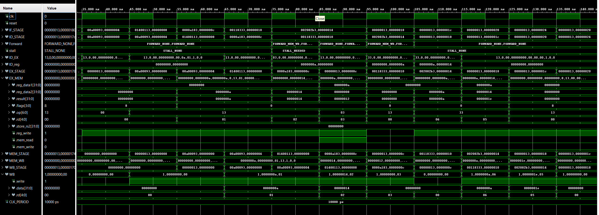

# Pipelined-RISC-V-CPU-in-VHDL-From-Scratch-to-Simulation
This project is a fully custom, 5-stage pipelined RISC-V CPU built from the ground up in VHDL. 
Each pipeline stage—Instruction Fetch (IF), Decode (ID), Execute (EX), Memory Access (MEM), and Write Back (WB)—was designed with a modular architecture and verified independently to ensure signal integrity and data flow consistency.

## Key features

- 5-stage pipeline: IF, ID, EX, MEM, WB
- ALU operations, load/store support
- Word-aligned memory interface with internal DATA_MEM
- Pipeline registers for each stage 
- Register file write-back with control signal handling
- Hazard-aware architecture: full forwarding and stall handling implemented.
- All design and testing done by me as a deep-dive into CPU architecture

## Tool Used
Vivado version 24.2
Vivado XSim (Built-in simulator, used for VHDL simulation and waveform viewing)

## Open Questions
Design Questions — Port Entry vs Internal Signal

As I was building my pipeline registers and debugging signal flow, I started wondering about the trade-offs between two design choices:

- Option 1: Expose signals as port entries between modules
- Option 2: Keep signals internal and connect them through internal logic

Questions I’m still exploring:
- From a design clarity and maintainability perspective, which approach scales better as the system grows?
- From a hardware synthesis / resource cost perspective, does using ports introduce more overhead than using internal signals?
- Are there any best practices or guidelines for when to prefer one over the other in pipeline register design?

If anyone has insights or resources on this, I would love to learn! I’d like to apply better-informed decisions on my next project.

## Pipeline Diagram
IF --> ID --> EX --> MEM --> WB

## Project Structure
**PIPELINE**/
- images/
- src/
    - RISCV_CPU.vhd (Main)
    - Pipeline_Objects.vhd (Constant, type declaration, and initialization)
    - IF_STA.vhd
        - INST_MEM.vhd (Instruction Memory)
    - IF_TO_ID.vhd
    - DECODER.vhd
        - Register_File.vhd
    - ID_TO_EX.vhd
    - EX_STAGE.vhd
        - ALU_32bits.vhd
            - adder_32bits.vhd
                - FullAdder.vhd
            - sub_32bits.vhd
                - FullSubtractor.vhd
    - EX_TO_MEM.vhd
    - MEM_STA.vhd 
        - DATA_MEM.vhd (Data Memory)
    - MEM_TO_WB.vhd
    - WB_STA.vhd
    - reusable_function.vhd
    - reusable_func_def_.vhd
- test_benches/
    - tb_RISCV_CPU.vhd
- .gitignore
- README.md

### Personal Note
- I initially followed existing RISC-V pipeline diagrams, but found they lacked enough detailed information for full implementation. To address this, I made several design modifications based on my own testing and understanding of hazard timing and pipeline behavior. The resulting pipeline reflects these practical adjustments.

- Once the project is complete, I plan to remove unnecessary signals from the record types in some of the stages. For now, I am keeping these extra signals to aid in debugging.

## Design Note — Control Signals
Instead of passing the full opcode through the pipeline, I generate compact control signals during instruction decode. This reduces the number of bits transferred between stages and simplifies control logic in later stages.

While designing this, I considered whether to use:
- a packed 2-bit control field, or
- 3 individual control bits.

At the moment, it looks like using a 2-bit field is more efficient, since combining 3 single bits would use more total bits overall. However, not all pipeline stages need all of the control signals, so I’m still evaluating the best structure.

If anyone has recommendations or best practices for control signal encoding in pipelined CPU designs, I would love to learn from your experience!

### Design Note — IF STAGE
**Pipeline Reset Handling**: 
After reset, I added a conditional check to insert a NOP instead of fetching the instruction at address 0. This prevents the appearance of duplicate instructions at PC = 0, which could otherwise cause confusion in the waveform. Additionally, I designed the IF stage to always pass the current PC and current instruction to the next stage. This ensures that each stage clearly reflects the actual instruction residing at its corresponding PC address, making the pipeline flow easier to trace and debug.

### Design Note: ID STAGE
- I encapsulated the Decoder and Hazard Detection Unit (HDU) into a single ID_STAGE module, because the earliest point where hazards can be detected is during decoding — once the instruction type, register sources, and dependencies are known.

### Design Note: EX stage
- I encapsulated the Forwarding MUX and the Execution stage (ALU and control) into a single EX_STAGE module, because forwarding decisions directly affect which operand values are sent to the ALU. By keeping them in the same stage, I can guarantee correct data selection and simplify timing and debugging.

### Design Note: WB_STAGE 
- In the WB_STAGE, I implemented logic to decide which value should be forwarded back to the ID stage: either the memory load result or the ALU result.
- If both mem_read = '1' and reg_write = '1', then the value forwarded is from memory (mem_result).
- Otherwise, if it is an ALU or other operation, the forwarded value is from EX/MEM (ex_result).

This ensures that the ID stage (hazard detection and forwarding) always receives the correct data for any instruction type — LOAD or ALU.

### Design Note: Forwarding
- I chose not to pass the raw register values (reg_data1, reg_data2) through the ID/EX register.
- Instead, I implemented bypass forwarding — the Forwarding MUX is placed after the ID/EX register, but it selects the correct operand based on current forwarding conditions.
- This prevents stale or incorrect data from reaching EX_STAGE during forwarding.

**Logic**: if EX_MEM.reg_write = '1' and EX_MEM.rd /= ZERO_5bits and EX_MEM.rd = ID_EX.rs1/ID_EX.rs2 then
                Forward.A (or Forward.B) <= FORWARD_EX_MEM;
            elsif MEM_WB.reg_write = '1' and MEM_WB.rd /= ZERO_5bits and MEM_WB.rd = ID_EX.rs1/ID_EX.rs2 then
                Forward.A (or Forward.B) <= FORWARD_MEM_WB;
            else
                Forward.A <= FORWARD_NONE;
            end if;

### Design Note: Stall Handling
When a stall is detected, I pass the stall signal to multiple stages:
- In IF_STAGE and IF/ID, I hold the PC (PC is not updated).
- In ID/EX, I also hold the PC value, but for debugging purposes, I inject a NOP into the pipeline:
- The instruction type is set to the decoded NOP value.
- Additionally, in the Forwarding MUX, I set the register operand values to 0 during a stall, to ensure that no unintended data or partial results propagate forward, and to prevent any ALU delay or spurious computation during the stalled cycle.

**Logic**: if ID_EX.mem_read = '1' and 
        (ID_EX.rd = ID.rs1 or ID_EX.rd = ID.rs2) then
            stall_out <= STALL_NEEDED;
        else
            stall_out <= STALL_NONE;
        end if;

### Design Note: Branch
In the Decode stage, I decode the branch instruction and rearrange the immediate value according to the RISC-V specification. The immediate is then shifted left by one bit and added to the current PC to compute the branch target address. This branch target is passed down the pipeline to the IF stage. If the flush signal is later asserted (when the branch condition is determined to be true), the branch target will become the next PC. However, due to pipeline latency, the instruction at the branch target address will not appear in the pipeline until the following cycle. In the EX stage, I use the ALU flags to evaluate the branch condition and determine whether the branch should be taken. If so, the flush signal is asserted to update the PC and flush any incorrect instructions already in the pipeline.

### Debug Tips:
- I chose to inject a NOP into the ID/EX stage during a stall so that it is easy to visualize the stall in the waveform — the NOP acts as a clear marker.
- This makes it obvious when the pipeline is holding due to a hazard, and prevents any misleading partial or invalid instruction from appearing downstream.
- Setting the reg values to zero in the Forwarding MUX also helps ensure that EX_STAGE outputs 0 during stalls.

 

**How did I confirm the pipeline is working properly?** 
To verify that the pipeline stages were functioning as intended, I observed the flow of instructions across each stage in the waveform viewer.

Here’s how the pipeline filled after memory stabilize :
- **Cycle 1**: Instruction 1 in IF
- **Cycle 2**: Instruction 1 in ID, Instruction 2 in IF
- **Cycle 3**: Instruction 1 in EX, Instruction 2 in ID, Instruction 3 in IF
- And so on — each instruction advances one stage per clock cycle.
    
This confirmed that my pipeline was flowing correctly: no stages were skipped, and instructions advanced in a staggered manner through the pipeline.

**How did I verify stalling works?**
- Made sure nop is inserted after load instruction.

**How did I verify Forwading works?**
- Made sure the operands in ex_stage is what I expected.

## More DEBUGGING Strategies
### Debugging note
For debugging, you can organize signals in the testbench however you prefer — for example, moving signals into different waveform groups or adding trace logging.
In this project, since I’m currently testing with only 4 instructions, I used a simpler debug method. However, for larger programs or full instruction sets, it is highly recommended to pass the PC and instruction fields through each pipeline stage and group them accordingly in the testbench and waveform viewer.

This is why in my design, I pass PC and instruction through all stages — the main purpose is to support clear debugging and visibility at each stage, especially as the project scales.

**Tip**: Using a **record type** for your pipeline signals makes your code much cleaner and easier to debug. In the waveform viewer, records are displayed as expandable groups. This allows you to quickly spot problems — if you see a signal that is not green, you can expand the record and immediately pinpoint which field is incorrect.

However, just seeing "all green" does not guarantee that everything is working correctly. You still need to carefully check that each value matches your expectations and is appearing at the correct stage and cycle. If something looks off, go back and investigate — even if the signal colors look fine.

### Wave debugging
**Warning Note**: If you're a beginner like me, don’t do what I did — avoid trying to add too many instructions at once! Start with just a couple of known instructions and add more as you get comfortable. Otherwise, you’ll start seeing "double" in the waveforms. 

**Additional Note**: Be patient — debugging is a skill that improves with practice.

### Tcl Console technique
For the full pipeline integration, I did not use the Tcl console extensively yet — because I am still building a solid understanding of how pipelined CPUs work. My goal is to improve this as I progress through the project. If anyone has recommendations or best practices for using Tcl console in this context, I would love to learn from them.

However, here is the general approach I used when testing individual modules:
- I used a variable to track whether each test passed or failed.
- If any test failed, I added a separate "fail tracking" variable to help locate the issue.
- I also inserted additional assertions at key points where I suspected things could go wrong.
- From there, I systematically narrowed down the bugs by following the failing signals.

This method helped me debug module-level behavior even without fully using Tcl automation yet. I plan to expand this technique as I become more comfortable with pipeline-level debugging.

**Note**: You’ll find earlier versions of each pipeline stage in the individual repositories. These earlier modules were initially hardcoded and included design assumptions I later realized were incorrect. Through full system integration, I restructured the design to follow correct pipeline flow and made the architecture scalable and modular.

Even though I’ve revised some of the early logic, the original documentation and waveforms still show why I implemented certain flags the way I did. You might also find the randomized testbenches helpful for testing your own designs.

- **IF_STAGE** https://github.com/NoridelHerron/INSTRUCTION_FETCH
- **ROM** https://github.com/NoridelHerron/MEMORY_MODULE
- **ID_STAGE** https://github.com/NoridelHerron/ID_STAGE
- **REGISTERS** https://github.com/NoridelHerron/32x32-bit-Register-File-in-VHDL-
- **EX_STAGE** https://github.com/NoridelHerron/EX_STAGE
- **ALU** https://github.com/NoridelHerron/ALU_with_testBenches_vhdl
- **MEM_STAGE** https://github.com/NoridelHerron/MEM_STAGE
- **DATA_MEM** https://github.com/NoridelHerron/DATA_MEM
- **WB_STAGE** https://github.com/NoridelHerron/WB_STAGE

## What's next 
Implement jump, and branch handling

## Future exploration
- Explore implementing a Von Neumann architecture CPU
- Compare design trade-offs between my current pipeline and a Von Neumann model

## ▶️ How to Run

1. Launch **Vivado 2019.2** or later
2. Create or open a project and add:
    - `src/*.vhd` (design files)
    - `test_bench/*.vhd`
3. Set the `test bench` as the simulation top module
4. Run Behavioral Simulation:
    - *Flow > Run Simulation > Run Behavioral Simulation*
5. Increase simulation time if needed
---

## 👤 Author
**Noridel Herron**  
Senior in Computer Engineering – University of Missouri  
✉️ noridel.herron@gmail.com  
GitHub: [@NoridelHerron](https://github.com/NoridelHerron)

---

## 🤝 Contributing
This is a personal academic project. Feedback and suggestions are welcome via GitHub issues or pull requests.

---

## 📜 License
This work is licensed under the Creative Commons Attribution-NonCommercial 4.0 International License (CC BY-NC 4.0).

You are free to:
- Share — copy and redistribute the material in any medium or format
- Adapt — remix, transform, and build upon the material

Under the following terms:
- Attribution — You must give appropriate credit, provide a link to the license, and indicate if changes were made.
- NonCommercial — You may not use the material for commercial purposes without explicit permission from the author.

You are free to:
- Share — copy and redistribute the material in any medium or format
- Adapt — remix, transform, and build upon the material

Under the following terms:
- Attribution — You must give appropriate credit, provide a link to the license, and indicate if changes were made.
- NonCommercial — You may not use the material for commercial purposes without explicit permission from the author.

For commercial licensing inquiries, please contact: [noridel.herron@gmail.com]
License details: https://creativecommons.org/licenses/by-nc/4.0/
---

## ⚠️ Disclaimer
This project is for **educational use only**. Some components may be experimental and are not intended for production use.
